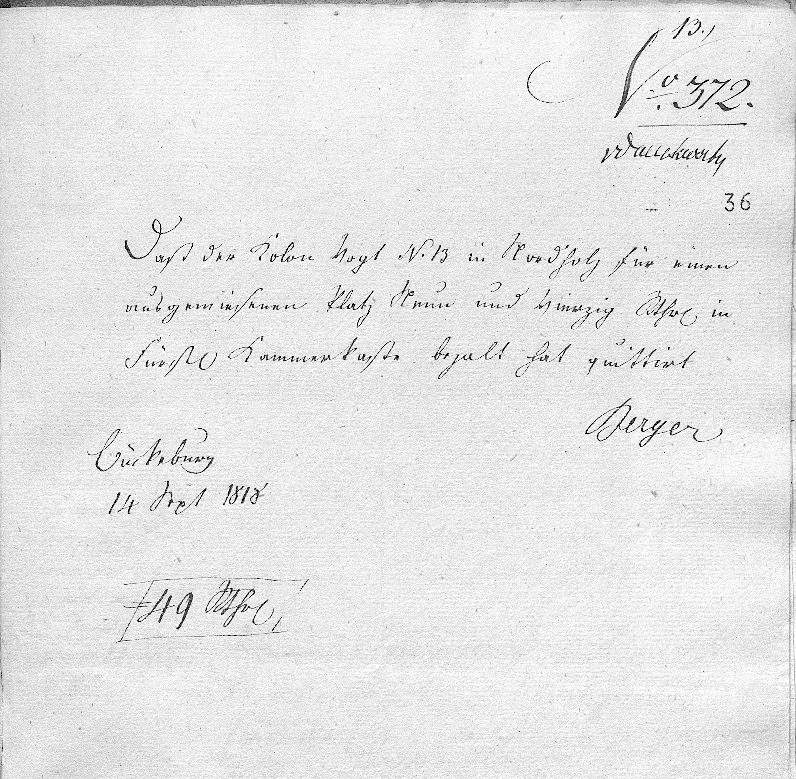

# Digital Image {#_digital_image}

<!-- Malformed Antora Block: ::: {wrapper="1" link="self" title="Receipt"} -->

:::

## Transliteration and Translation {#_transliteration_and_translation .narrow}

```

{.bordered subs="verbatim,quotes"}
13.)

No. 372.

[vdankwarts]

Daß der Kolon Vogt N. 13 in Nordholz für einen
ausgewiesenen Platz Neun und vierzig Rthr in
Fürstl. Kammerkasse bezahlt hat quittirt.

Berger

Bückeburg
14 Sept 1818

49 Rthlr
```

``` {.bordered subs="verbatim,quotes"}
This is to certify that the colonist Vogt, no. 13 in Nordholz, has paid
forty-nine Reichsthaler into the Princely Chamber Treasury for an assigned
plot of land, for which payment is hereby acknowledged.
```
