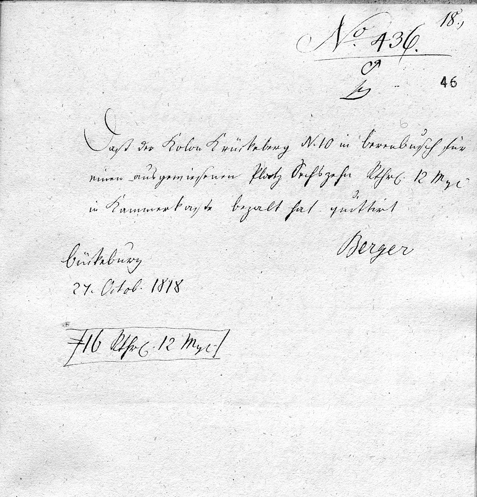

# Chamber Treausry Recept {#_chamber_treausry_recept}

<!-- Malformed Antora Block: ::: {wrapper="1" link="self" width="65%"} -->

:::

## Transliteration and Translation of Outer Address Page {#_transliteration_and_translation_of_outer_address_page .narrow}

:::: {.bordered subs="verbatim,quotes"}
::: title
Translation
:::

    18.)

    No. 436.

    Daß der Kolon Krückeberg N. 10 in Berenbusch für einen ausgewiesenen Platz
    Sechszehn Rthrl. 12 Mg Kammerkasse bezalt hat quittirt.

    Berger

    Bückeburg
    27. Octob. 1818

    16 Rthrl. 12 Mg.
::::

:::: {.bordered subs="verbatim,quotes"}
::: title
Transliteration
:::

    18.)

    No. 436.

    That Colon Krückeberg No. 10 in Berenbusch has paid into the Chamber
    Treasury Sixteen Reichsthaler 12 Mariengroschen for an assigned plot is
    hereby acknowledged.

    Berger

    Bückeburg
    27 October 1818

    16 Reichsthaler 12 Mariengroschen
::::
