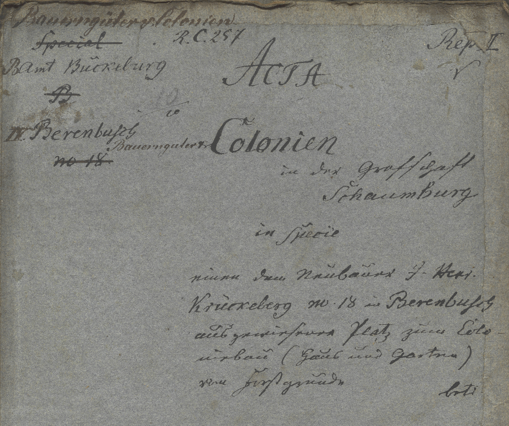

# Summary {#_summary .narrow}

Administrative cover for a Rentkammer case concerning the assignment of a house-and-garden building plot on princely land in Berenbusch to Neubauer J. Heinrich Krückeberg, No. 18, under the agrarian holding colonization program of the County of Schaumburg, handled by the Bückeburg district office.

## Image {#_image}

<!-- Malformed Antora Block: ::: {wrapper="1" link="self" title="Case file cover (Click to Enlarge)"} -->

:::

## Transliteration and Translation {#_transliteration_and_translation .narrow}

:::: {.bordered subs="verbatim,quotes"}
::: title
Transliteration
:::

    Bauerngüters Colonien                     Rep. I
    [.line-through]#Special#
    R. C. 257

    BAmt Bückeburg

    II Berenbusch

    Bauerngüter Colonien
        in der Grafschaft
        Schaumburg

    in specie
    einen dem Neubauer J. Henr.
    Krückeberg Nr. 18 zu Berenbusch
    ausgewiesenen Platz zum Colonie-
    bau (Haus und Garten)
    vor Furstgrunde

    Berenbusch no. 18
::::

:::: {.bordered subs="verbatim,quotes"}
::: title
Translation
:::

    Agrarian tenancy holdings                Series I
    [.line-through]#Special#
    R. C. 257

    Bückeburg District Office

    II Berenbusch

    Peasant Holdings Colonies
        in the County of
        Schaumburg

    in particular
    a specifically designated
    parcel assigned to the new settler
    J. Henr. Krückeberg No. 18 at Berenbusch
    for colony construction
    (house and garden)
    on princely land

    Berenbusch no. 18
::::
