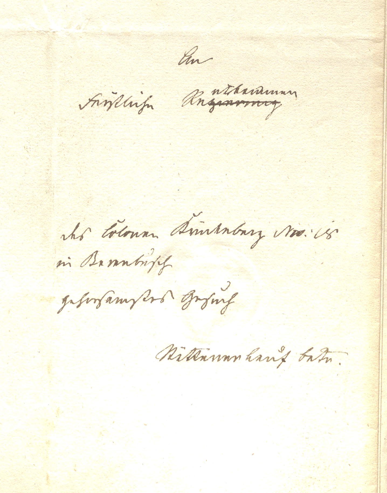

# Image {#_image}

<!-- Malformed Antora Block: ::: {wrapper="1" link="self" width="75%"} -->

:::

## Transliteration and Translation {#_transliteration_and_translation .narrow}

:::: {.bordered subs="verbatim,quotes"}
::: title
Transliteration
:::

    An Fürstliche Rentkammer

    des Colonen Krückeberg No 18 in Berenbusch gehorsamstes Gesuch

    Stättener Lauf betr.
::::

:::: {.bordered subs="verbatim,quotes"}
::: title
Translation
:::

    Most humble petition of Colon Krückeberg No. 18 in Berenbusch concerning
    the transfer of his holding
::::
