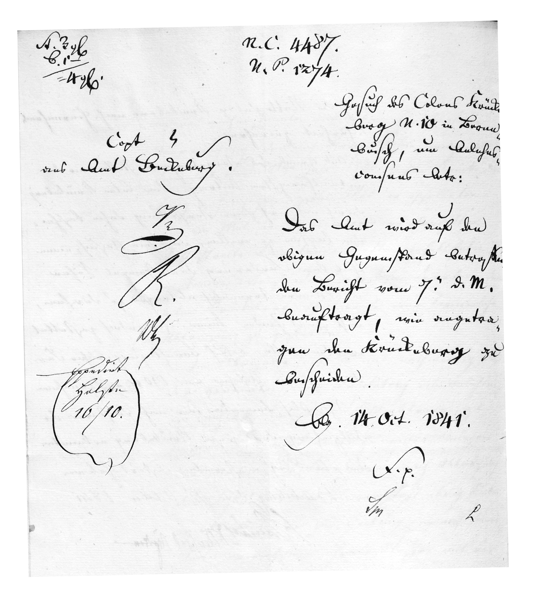
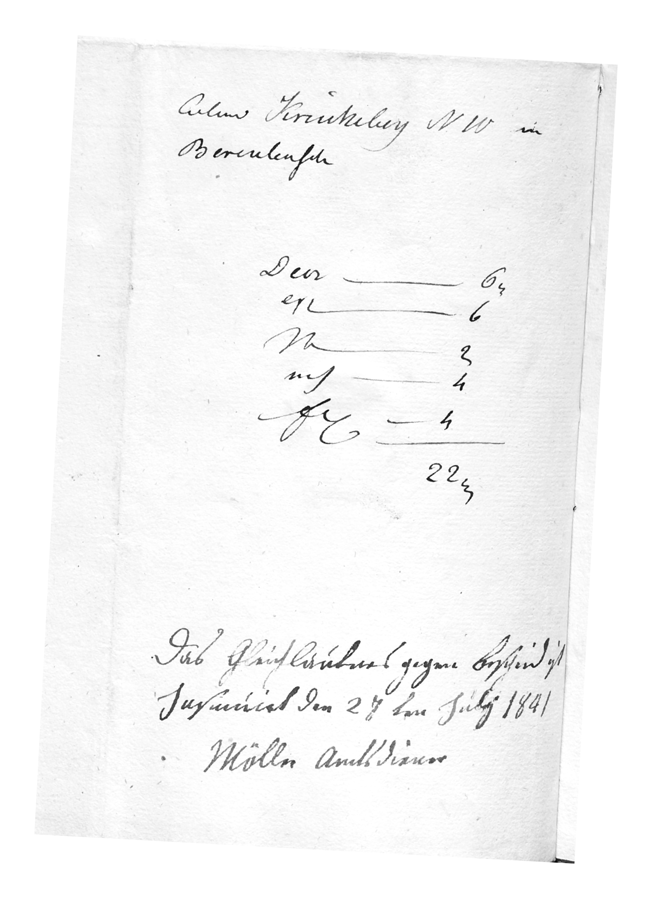

# Summary {#_summary .narrow}

This cover slip records the Rentkammer's resolution of 14 October 1841: the Amt is instructed to notify Krückeberg in line with its 7 October report. The initials mark the concurrence of Kammer officials, and the expedition note shows clerk Holste dispatched the decision on 17 November 1841.

## Image of Official Order {#_image_of_official_order}

<!-- Malformed Antora Block: ::: {wrapper="1" link="self" title="Click to Enlarge"} -->

```

## Transliteration and Translation {#_transliteration_and_translation}

```
:widths: 50 50
:header-rows: 1

* - Transliteration
  - Translation
* - N. 3/6                            N.C. 4487 C. 1/                              N.P. 1274 ------ = 4/6.                            Gesuch des Colons Krücke-     Copt[Concept]         berg N. 10 in Beren- aus Amt Bückeburg.        busch, um Anlehns-                           consens betr:  [initials]         Das Amt wird auf den Fr.                obigen Gegenstand betreffen- R.                 de Bericht vom 7. d. M.                    beauftragt, wie angetra- Expedirt           gen den Krückeberg zu  Holste             bescheiden. 17/11.                        Bbg. 14. Oct. 1841.                       F. p.[Für protokoll]                       [clerial initials:] Lm        L
  - N. 3/6                            N.C. 4487 C. 1/                              N.P. 1274 ------ = 4/6.   Draft from the Bückeburg Office.  Petition of the Colon Krückeberg No. 10 in Berenbusch,  concerning the approval of a loan.   The Office is instructed, based on the report of the 7th of this month regarding the matter above, to respond to Krückeberg as requested.  Bückeburg, 14 October 1841.  This document has been officially recorded and put on file [clerial initials:] Lm        L
```

## Billing Note {#doc-index-2-3 .narrow}

The image below is a postscript accounting note made after the decision had already been formally served. It is a billing note documenting what Krückeberg owed for:

- having the Rentkammer's decree written, registered, sealed, and dispatched,

<!-- -->

- and for receiving the official copy (the Gegen-Bescheid).

These were small, fixed fees established in the Kanzleiordnung (Chancery Fee Ordinance) --- standard administrative costs, not fines or penalties. Here is what each of them means:

```
:widths: 10 20 50 20
:header-rows: 1

* - Abbrev.
  - Word
  - Meaning
  - Type of Fee
* - Decr
  - Decret(gebühr)
  - Fee for issuing the Decret — the official decree, rescript, or order of the chamber (the decision document).
  - Decision / resolution fee
* - Exp
  - Expeditionsgebühr
  - Fee for the Expedition — the formal dispatch of the document to the recipient (clerical processing, sealing, and sending).
  - Dispatch fee
* - Mem
  - Memorialgebühr
  - Fee for the Memorial entry — entering the act into the office register or memorial ledger.
  - Registration fee
* - Act
  - Actengebühr
  - Fee for filing or maintaining the Akte (case file) itself.
  - Filing fee
* - Fol
  - Foliogebühr
  - Fee based on the number of Folios (pages) in the document.
  - Per-folio (per page) fee
```

<!-- Malformed Antora Block: ::: {wrapper="1" link="self" title="Click to Enlarge"} -->

```

## Transliteration and Translation {#_transliteration_and_translation_2}

```
:widths: 50 50
:header-rows: 1

* - Transliteration
  - Translation
* - Colon Krückeberg N 10 in Berenbusch   Decr ....... 6½   Exp ........ 6   Mem ........ 2   Act ........ 4   Fol ........ 4           .......            22½  Das Gleichlautende gegen Bescheid ist Insinuirt den 27ten July 1841 Möller Amtsdiener
  - Colon Krückeberg N 10 in Berenbusch   Decr _______ 6½   Exp ________ 6   Mem ________ 2   Act ________ 4   Fol ________ 4           ________               22½ The identical counterpart of the decision was served on 27 July 1841. Möller, office servant.
```
